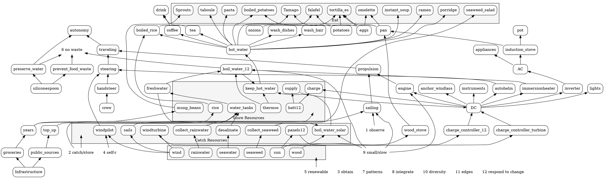

```dot
digraph{ rankdir=BT fillcolor=whitesmoke style=filled node[id="\\N" shape=box style="rounded,filled" fillcolor=white tooltip=" " ] edge [ id="\\T___\\H" ]


{ node[shape=none]
pp01 [ label="1 observe"     tooltip="Observe and Interact" ]
pp02 [ label="2 catch/store" tooltip="Catch and Store Resources" ]
pp03 [ label="3 obtain"      tooltip="Obtain a Yield" ]
pp04 [ label="4 self-r"      tooltip="Apply Self-Regulation" ]
pp05 [ label="5 renewable"   tooltip="Use Renewable Resources" ]
pp06 [ label="6 no waste"    tooltip="Produce No Waste" ]
pp07 [ label="7 patterns"    tooltip="Design from Patterns to Details" ]
pp08 [ label="8 integrate"   tooltip="Integrate Rather than Segregate" ]
pp09 [ label="9 small/slow"  tooltip="Use Small and Slow Solutions" ]
pp10 [ label="10 diversity"  tooltip="Use and Value Diversity" ]
pp11 [ label="11 edges"      tooltip="Use Edges and Value the Marginal" ]
pp12 [ label="12 respond to change" tooltip="Creatively Use and Respond to Change" ]
}

{ node[shape=none style=invis label=""] iv1 iv2 iv3 }

subgraph cluster_eat{ label="Eat" labelloc=top
instant_soup ramen porridge falafel taboule pasta Tamago boiled_potatoes
seaweed_salad
tortilla_es omelette
Sprouts
}

{boiled_rice eggs} -> Tamago
potatoes -> boiled_potatoes

{node [label=charge] chargebatt12 
#chargebatt48 
}
{node [label=supply] batt12supply 
#batt48supply 
}

subgraph cluster_store{ label="Store Resources"
chargebatt12 batt12 batt12supply
#chargebatt48 batt48 batt48supply
thermos keep_hot_water
water_tanks
mung_beans
rice
iv2
}
pp02 -> iv2

mung_beans -> Sprouts

subgraph cluster_catch{ label="Catch Resources"
panels12
#panels48
boil_water_solar
sails
windpilot
windturbine
collect_rainwater
desalinate
collect_seaweed
iv1
}
pp02 -> iv1

subgraph cluster_renewables {
sun wind 
iv3
seawater
rainwater
seaweed
wood
}
pp05 -> iv3

seaweed -> collect_seaweed -> seaweed_salad

rainwater -> collect_rainwater -> water_tanks
seawater  -> desalinate        -> water_tanks
Infrastructure -> public_sources -> top_up -> water_tanks
Infrastructure -> groceries -> years -> { mung_beans rice }

rice -> boiled_rice

 V12 [label="DC"]
#V48 [label="48 V"]
V230 [label="AC"]

siliconespoon -> prevent_food_waste -> pp06
siliconespoon -> preserve_water     -> pp06
preserve_water -> autonomy

V12 -> immersionheater -> boil_water_12 -> pp06
thermos -> boil_water_12 -> keep_hot_water
thermos -> keep_hot_water

sun -> boil_water_solar
freshwater -> boil_water_solar -> keep_hot_water -> hot_water
freshwater -> boil_water_12

water_tanks -> freshwater

hot_water -> {wash_dishes wash_hair}
hot_water -> {tea coffee} -> drink
hot_water -> {instant_soup ramen porridge falafel taboule pasta boiled_rice boiled_potatoes}

 sun -> panels12 -> charge_controller_12 -> V12
#sun -> panels48 -> charge_controller_48 -> V48

batt12supply -> V12-> chargebatt12
batt12 -> { chargebatt12 batt12supply }

#batt48supply -> V48-> chargebatt48
#batt48 -> { chargebatt48 batt48supply }

V12 -> {lights anchor_windlass instruments}

V12 ->
#stepup -> V48
#V48 ->
engine -> propulsion

#V48 
V12
-> inverter -> V230 -> {induction_stove appliances}

induction_stove -> {pan pot}
wood -> wood_stove -> pan -> falafel

{pan eggs potatoes onions} -> tortilla_es

{pan eggs} -> omelette

crew -> handsteer -> steering
wind -> windpilot -> steering              -> traveling
wind -> sails     -> sailing -> propulsion -> traveling -> autonomy
pp04 -> windpilot
wind -> windturbine -> charge_controller_turbine -> V12

V12 -> autohelm -> steering

pp09 -> { sailing engine boil_water_solar boil_water_12 }

pp01 -> sailing

}
```

```js 
// if you see this code on Leanpub, then at least some diagrams have not been converted to SVG images yet
import{ digraph, digraph2svg, visco } from "@kxfm/browser"
```
