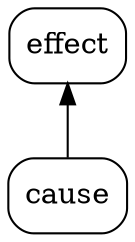

# x Layout Tests

A chapter to test different technical features, such as Markdown tags and images, in the context of Leanpub and Observable Framework.

## a - inline diagram
Leanest case: ${digraph `root -> intermediate -> result`} inline client-side diagram 

*(works ONLY in Observable Framework, not in Leanpub)*

## b - code block diagram
Client-side diagram from fenced code block:
```js
digraph`more[label="more ..."] root -> intermediate -> more -> symptom`
```

*(works ONLY in Observable Framework, not in Leanpub)*

## c - as above plus VisCo 
Client-side diagram from fenced code block, plus Visco initialization:
```js
digraph`more[label="..."] root -> intermediate -> more -> result  node[label="side effect"] root->side1 intermediate->side2 `
.then( d => d
  .explore( 'root' )
  .explore( 'result' )
  .e( 'j' )
 )
```

*(works ONLY in Observable Framework, not in Leanpub)*

Test cases a - c above all take their diagram definition from within this markdown document (in Observable Framework). This requires a proprietary Markdown extension by Observable, a technique which is not compatible with Leanpub. However it is great for first draft documents, which can be written and previewed in Obs Framework Dev server. 

Before publishing them on Leanpub, such diagrams need to be refactored: extract DOT code from MD manuscript to a new file, use an Observable data loader for conversion of DOT to SVG, then replace reference in MD manuscript to MD image tag (such as in test case d)
- - -

## d - SVG image
Below is an SVG image from a source (file) which is external to this Markdown file, but local to the manuscript, and thus should be compatible with Leanpub.

Mind that an SVG *image* can't be interactive. This is perfectly fine in books (perhaps not in courses), unless the author wishes to add some selection to the diagram (such as in exampe c above).


SVG image, coded as markdown (for Leanpub) and softlinked the SVG file resource for Obs

**This is the only compatible technique which works in Leanpub AND Obs Framework (and only if we apply the softlink hack)**

Also this technique has the best potential for re-using the diagram, as its (DOT) source is kept as a separate file, and the SVG gets generated automatically (by Obs Framework Preview server, or Obs Framework Build process).

- - -

## e - inline SVG
In theory, we could inline SVG source as HTML-like code inside MD.

There are two reasons why this is not a useful workflow for a manuscript which is meant to be used at Leanpub:

1. Markua on Leanpub does not support HTML (and SVG) tags directly. There needs to be a directive around it. So the code would not be interoperable between Leanpub and other MD implementations (Obs Framework Dev server e.g.)

1. Inserting the SVG from a source which had produced it is a manual process. It is just easier to generate an SVG by a dataloader, as in test case c.

Hence, here is not even an attempt to inline SVG code.

- - -

## f - Graphviz (dot) code block



This is lacking the interactive VisCo features, but is a nice simple way for adhoc diagrams that render in Observable and in the VIM MarkdownPreview plugin.

*(works ONLY in Observable Framework and VIM MarkdownPreview, not in Leanpub)*

## Footnotes and Endnotes

Test for a footnote: [^xfn]

Test for an endnote: [^^xen]

[^xfn]: This is a footnote.

[^^xen]: This is an endnote. Observable cannot produce something like this which goes to the "end of a book", but fortunately accepts the endnote syntax and presents it like a footnote. On Leanpub, this endnote will actually go to the end of the book (with proper theme settings). So we can use both: footnotes and endnotes, in our markdown source, preview them decently in Obs, and have them work in Leanpub.


## External Hyperlinks

+  https://leanpub.com/ *just the URL, no explicit markdown hyperlink*
+ [https://leanpub.com/](https://leanpub.com/) *MD hyperlink since Leanpub does not seem to use linkify*
+ [kxfm Portfolio on Observable](https://kxfm.observablehq.cloud/1/)


```js 
// if you see this code on Leanpub, then at least some diagrams have not been converted to SVG images yet
import{ digraph, digraph2svg, visco } from "@kxfm/browser"
```
