# z Figures

this page exists only to trigger SVG generation from DOT on Observable Preview or Build, because the Markdown URL to reference an image differs in Leanpub

this page should not be included in any Leanpub Book or Course, because the explicit path step **resources** is implied on Leanpub and actually breaks the URL, where in standard Markdown (and on Observable) this path step is required.

## SVG generated by Observable data loader




## Visco Diagrams with inline DOT definition

```js
digraph `

travel -> {simple sustainable happy}

`
```

```js 
import{ digraph, digraph2svg, visco } from "@kxfm/browser"
```
